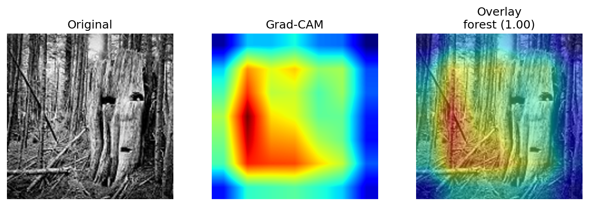

Intel Görüntü Sınıflandırma: fastai ile Doğal Ortam Tespiti

Bu proje, Intel Image Classification veri setini kullanarak doğal ve yapay ortam görsellerini (binalar, orman, buzul, dağ, deniz, sokak) sınıflandırmak için fastai ve ResNet18 mimarisini kullanır. Proje, transfer öğrenimi (transfer learning) tekniğinden faydalanarak yüksek doğruluklu bir model eğitmeyi amaçlamaktadır.

(Yukarıdaki görsel, modelin 'orman' sınıfını tahmin ederken hangi piksellere odaklandığını gösteren bir Grad-CAM çıktısıdır. Kendi görsellerinizi eklemeyi unutmayın.)

 

📜 İçindekiler

🔗 Bağlantılar

✨ Temel Özellikler

🗂️ Proje Yapısı

🧭 Yöntem ve Akış

📊 Sonuçlar

🚀 Nasıl Çalıştırılır?

Kaggle (Önerilen Yöntem)

Lokal Ortamda Tahmin (Inference)

🔮 Gelecek Geliştirmeler

✅ Proje Gereksinimleri

 

🔗 Bağlantılar
Kaynak	Bağlantı
🚀 Kaggle Notebook	GlobalAI Notebook
📦 Model Ağırlıkları	GitHub Release v0.1.0
💾 Veri Seti	Intel Image Classification
 

✨ Temel Özellikler

Veri İşleme: fastai DataBlock API'si ile verimli veri yükleme, önişleme ve augmentasyon.

Model: ImageNet üzerinde ön-eğitilmiş ResNet18 mimarisi ile transfer öğrenimi.

Eğitim: Learning Rate Finder ile en uygun öğrenme oranının tespiti ve fine_tune ile modelin eğitilmesi.

Değerlendirme: Doğruluk/Kayıp grafikleri, Confusion Matrix ve Classification Report ile detaylı model analizi.

Açıklanabilirlik (XAI): Grad-CAM ile modelin tahminlerini hangi bölgelere bakarak yaptığının görselleştirilmesi.

Optimizasyon: Küçük bir grid-search ile hiperparametre optimizasyonu (HPO) denemesi.

Dağıtım: Modelin hem .pth (eğitim için) hem de .pkl (tahmin için) formatlarında kaydedilmesi.

 

🗂️ Proje Yapısı
code
Bash
download
content_copy
expand_less
.
├── notebooks/
│   ├── Intel_Image_Classification.ipynb  # Ana eğitim ve analiz notebook'u
│   └── export.pkl                        # Sadece tahmin için pratik model dosyası
│
├── reports/
│   ├── confusion_matrix.png              # Modelin karışım matrisi görseli
│   └── gradcam_example.png               # Örnek Grad-CAM çıktısı
│
└── README.md

Not: GitHub'ın 100 MB dosya limiti nedeniyle, eğitilmiş model ağırlıklarını içeren .pth dosyası bu repoda bulunmamaktadır. Dosyaya yukarıdaki GitHub Release bağlantısından ulaşabilirsiniz.

 

🧭 Yöntem ve Akış

Veri Hazırlığı: fastai'nin DataBlock API'si kullanılarak veri seti 80/20 oranında eğitim ve validasyon olarak ayrıldı. Görüntüler 224x224 boyutuna getirildi.

Veri Artırma (Augmentation): Eğitim verisine çeşitlilik katmak için flip, rotate(±8°), zoom(1.1) ve lighting(0.2) gibi augmentasyon teknikleri uygulandı.

Model Seçimi: ResNet18 mimarisi, transfer öğrenimi için temel model olarak seçildi.

Eğitim Stratejisi:

lr_find() ile optimum öğrenme oranı bulundu.

Modelin son katmanları 12 epoch boyunca dondurularak (frozen) eğitildi.

Tüm katmanlar çözülerek (unfrozen) daha düşük öğrenme oranları ile 5 epoch daha ince ayar (fine_tune) yapıldı.

Model Değerlendirme: Eğitim sonrası doğruluk, kayıp, karışım matrisi ve sınıflandırma raporu gibi metriklerle modelin performansı analiz edildi.

Model Kaydı: En iyi performansı gösteren model, hem fastai'nin export.pkl formatında hem de PyTorch'un standart .pth formatında kaydedildi.

 

📊 Sonuçlar

En İyi Validasyon Doğruluğu: ~%94.8

Test Doğruluğu (3000 Görüntü): ~%87.0

Zorlandığı Sınıflar: Modelin, benzer doku ve ufuk çizgisine sahip glacier ↔ mountain/sea sınıflarını zaman zaman karıştırdığı gözlemlendi.

Confusion Matrix

 

🚀 Nasıl Çalıştırılır?
Kaggle (Önerilen Yöntem)

Yeni bir Kaggle Notebook başlatın.

Add Data seçeneğinden puneet6060/intel-image-classification veri setini projenize ekleyin.

Sağ paneldeki Settings → Accelerator menüsünden GPU'yu seçin.

Bu repodaki notebooks/Intel_Image_Classification.ipynb dosyasını Kaggle'a yükleyin.

Hücreleri sırasıyla çalıştırın. Çıktı dosyaları (export.pkl, görseller vb.) /kaggle/working/ dizininde oluşturulacaktır.

Lokal Ortamda Tahmin (Inference)
Seçenek A: export.pkl ile (En Pratik Yol)

Bu yöntem fastai kütüphanesinin yüklü olmasını gerektirir ve tek bir dosya ile hızlıca tahmin yapmanızı sağlar.

code
Python
download
content_copy
expand_less
from fastai.vision.all import *

# Modeli yükle
learn = load_learner('notebooks/export.pkl')

# Görüntüyü aç ve tahmin et
img = PILImage.create('herhangi_bir_test_goruntusu.jpg')
pred, _, probs = learn.predict(img)

print(f"Tahmin Edilen Sınıf: {pred}")
print(f"Olasılık: {probs.max():.4f}")
Seçenek B: .pth Dosyası ile (Eğitime Devam Etmek İçin)

Bu yöntem, Release'ten indirilen model ağırlıklarını kullanarak eğitime devam etmenize veya modeli daha esnek bir şekilde kullanmanıza olanak tanır.

code
Python
download
content_copy
expand_less
from fastai.vision.all import *

# ÖNEMLİ: Eğitimde kullanılan DataLoaders (dls) yapısını tekrar oluşturmanız gerekir.
# Bu yapı, veri augmentasyon ve normalizasyon adımlarını içerir.
# dls = ... (Eğitimdeki gibi DataBlock ile oluşturun)

# Boş bir learner oluşturun
learn = vision_learner(
    dls, resnet18, metrics=accuracy,
    path=Path('.'), model_dir=Path('models')
).to_fp32()

# Release'ten indirdiğiniz dosyayı 'models' klasörüne kopyalayın
# Dosya yolu: 'models/resnet18-intel-best.pth' olmalıdır.
learn.load('resnet18-intel-best', with_opt=False)

# Tahmin yap
img = PILImage.create('herhangi_bir_test_goruntusu.jpg')
pred, _, probs = learn.predict(img)

print(f"Tahmin Edilen Sınıf: {pred}")
print(f"Olasılık: {probs.max():.4f}")
 

🔮 Gelecek Geliştirmeler

Daha Güçlü Mimariler: ResNet34/50, EfficientNet veya ConvNeXt gibi daha derin modellerle performansı artırmak.

Gelişmiş Augmentasyon: Mixup, CutMix, RandomErasing ve Test Time Augmentation (TTA) gibi teknikleri denemek.

Sınıf Dengeleme: Sınıf ağırlıkları (class-weight), focal loss veya oversampling gibi yöntemlerle azınlık sınıfların performansını iyileştirmek.

Deney Takibi: W&B veya MLflow entegrasyonu ile hiperparametreleri ve sonuçları daha sistematik bir şekilde takip etmek.

 

✅ Proje Gereksinimleri

Kaggle notebook + GitHub repo + README

Veri önişleme + Data Augmentation

CNN tabanlı model (ResNet18, Transfer Learning)

Accuracy/Loss grafikleri + Confusion Matrix + Classification Report

Grad-CAM ile model yorumlanabilirliği

Hiperparametre denemeleri (mini-grid)

Modelin farklı formatlarda kaydedilmesi (export.pkl / .pth)

(Bonus) TensorBoard entegrasyonu
