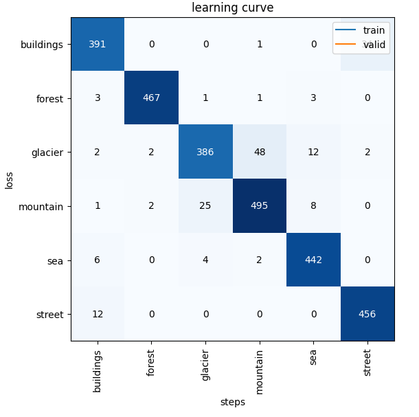

# Intel Görüntü Sınıflandırma: fastai ile Doğal Ortam Tespiti

Bu proje, **Intel Image Classification** veri setini kullanarak doğal ve yapay ortam görsellerini *(binalar, orman, buzul, dağ, deniz, sokak)* sınıflandırmak için **fastai** ve **ResNet18** mimarisini kullanır. Proje, **transfer öğrenimi** ile yüksek doğruluklu bir model eğitmeyi amaçlar.


---

## 📜 İçindekiler
- 🔗 Bağlantılar
- ✨ Temel Özellikler
- 🗂️ Proje Yapısı
- 🧭 Yöntem ve Akış
- 📊 Sonuçlar
- 🚀 Nasıl Çalıştırılır?
- 🔮 Gelecek Geliştirmeler
- ✅ Proje Gereksinimleri

---

## 🔗 Bağlantılar
- **Kaggle Notebook:** https://www.kaggle.com/code/fallerdem/globalai  
- **Model Ağırlıkları (Release):** https://github.com/FallErdem/intel-image-classification-fastai/releases/tag/v0.1.0  
- **Veri Seti (Kaggle):** `puneet6060/intel-image-classification`

---

## ✨ Temel Özellikler
- **Veri İşleme:** fastai **DataBlock API** ile verimli veri yükleme, önişleme ve augmentasyon  
- **Model:** ImageNet üzerinde ön-eğitilmiş **ResNet18** ile **transfer learning**  
- **Eğitim:** **Learning Rate Finder** ve `fit_one_cycle` + fine-tuning  
- **Değerlendirme:** Doğruluk/Kayıp grafikleri, **Confusion Matrix**, **Classification Report**  
- **Açıklanabilirlik (XAI):** **Grad-CAM** ile modelin baktığı bölgelerin görselleştirilmesi  
- **Optimizasyon:** Küçük **grid-search** ile hiperparametre denemesi (HPO)  
- **Dağıtım:** Modelin hem **`.pth`** (eğitim/devam) hem de **`.pkl`** (tahmin) formatlarında kaydı

---

## 🗂️ Proje Yapısı
.
├── notebooks/
<br>│ ├── Intel_Image_Classification.ipynb
<br>│ └── export.pkl
<br>├── reports/
<br>│ ├── confusion_matrix.png
<br>│ └── gradcam_example.png
<br>└── README.md

> **Not:** GitHub’ın 100 MB limiti nedeniyle eğitilmiş **`.pth`** dosyası repoda bulunmaz. **Releases** bağlantısından indirilebilir.

---

## 🧭 Yöntem ve Akış
- **Veri Hazırlığı:** fastai DataBlock ile veri seti %80 eğitim / %20 validasyon olarak ayrıldı; görüntüler **224×224** boyutuna getirildi.  
- **Veri Artırma (Augmentation):** `flip`, `rotate(±8°)`, `zoom(1.1)`, `lighting(0.2)` uygulandı.  
- **Model Seçimi:** **ResNet18** (ImageNet ön-eğitimli) tabanlı CNN.  
- **Eğitim Stratejisi:**
  1. `lr_find()` ile uygun öğrenme oranı aralığı bulundu,  
  2. **12 epoch** dondurulmuş katmanlarla (frozen) eğitim,  
  3. **5 epoch** tüm katmanlar açık (unfrozen) küçük LR ile fine-tuning.  
- **Model Değerlendirme:** Accuracy/Loss eğrileri, **Confusion Matrix**, **Classification Report**.  
- **Model Kaydı:** En iyi model **`.pth`** ve **`export.pkl`** olarak kaydedildi.

---

## 📊 Sonuçlar
- **En İyi Validasyon Doğruluğu:** ~**%94.8**  
- **Test Doğruluğu (3000 görüntü):** ~**%87.0**  
- **Zorlanan Sınıflar:** Benzer doku/ufuk çizgisi sebebiyle **glacier ↔ mountain/sea** karışmaları gözlendi.

**Confusion Matrix**  


---

## 🚀 Nasıl Çalıştırılır?

### Kaggle (Önerilen)
1. Yeni bir Kaggle Notebook başlatın.  
2. **Add Data:** `puneet6060/intel-image-classification` veri setini ekleyin.  
3. **Settings → Accelerator:** GPU seçin.  
4. Bu repodaki `notebooks/Intel_Image_Classification.ipynb` dosyasını yükleyin.  
5. Hücreleri sırayla çalıştırın; çıktılar `/kaggle/working/` altında oluşur.

### Lokal Ortamda Tahmin (Inference)

#### Seçenek A — `export.pkl` ile
```python
from fastai.vision.all import *

# Modeli yükle
learn = load_learner('notebooks/export.pkl')

# Görüntüyü aç ve tahmin et
img = PILImage.create('herhangi_bir_test_goruntusu.jpg')
pred, _, probs = learn.predict(img)

print(f"Tahmin Edilen Sınıf: {pred}")
print(f"Olasılık: {probs.max():.4f}")
from fastai.vision.all import *
from pathlib import Path

# ÖNEMLİ: Eğitimdekiyle aynı dls (224px, aynı normalize/augment) oluşturulmalı.
# dls = ...  # DataBlock ile kurun

# Learner
learn = vision_learner(
    dls, resnet18, metrics=accuracy,
    path=Path('.'), model_dir=Path('models')
).to_fp32()

# Releases'ten indirdiğiniz ağırlığı models/ klasörüne koyun:
# models/resnet18-intel-best.pth
learn.load('resnet18-intel-best', with_opt=False)

# Tahmin
img = PILImage.create('herhangi_bir_test_goruntusu.jpg')
pred, _, probs = learn.predict(img)

print(f"Tahmin Edilen Sınıf: {pred}")
print(f"Olasılık: {probs.max():.4f}")
```
------------------------------------------------------------------
#### Seçenek B — .pth ile
```python
from fastai.vision.all import *
from pathlib import Path

# ÖNEMLİ: Eğitimdekiyle aynı dls (224px, aynı normalize/augment) oluşturulmalı.
# dls = ...  # DataBlock ile kurun

# Learner
learn = vision_learner(
    dls, resnet18, metrics=accuracy,
    path=Path('.'), model_dir=Path('models')
).to_fp32()

# Releases'ten indirdiğiniz ağırlığı models/ klasörüne koyun:
# models/resnet18-intel-best.pth
learn.load('resnet18-intel-best', with_opt=False)

# Tahmin
img = PILImage.create('herhangi_bir_test_goruntusu.jpg')
pred, _, probs = learn.predict(img)

print(f"Tahmin Edilen Sınıf: {pred}")
print(f"Olasılık: {probs.max():.4f}")
```
## 🔮 Gelecek Geliştirmeler

Daha güçlü mimariler: ResNet34/50, EfficientNet, ConvNeXt

Gelişmiş augmentasyon: Mixup, CutMix, RandomErasing, TTA

Sınıf dengeleme: class-weight, focal loss, oversampling

Deney takibi: Weights & Biases / MLflow entegrasyonu

## ✅ Proje Gereksinimleri

Kaggle notebook + GitHub repo + README

Veri önişleme + Data Augmentation

CNN tabanlı model (ResNet18, Transfer Learning)

Accuracy/Loss grafikleri + Confusion Matrix + Classification Report

Grad-CAM ile model yorumlanabilirliği

Hiperparametre denemeleri (mini-grid)

Model kaydı (export.pkl / .pth)

(Bonus) TensorBoard entegrasyonu


